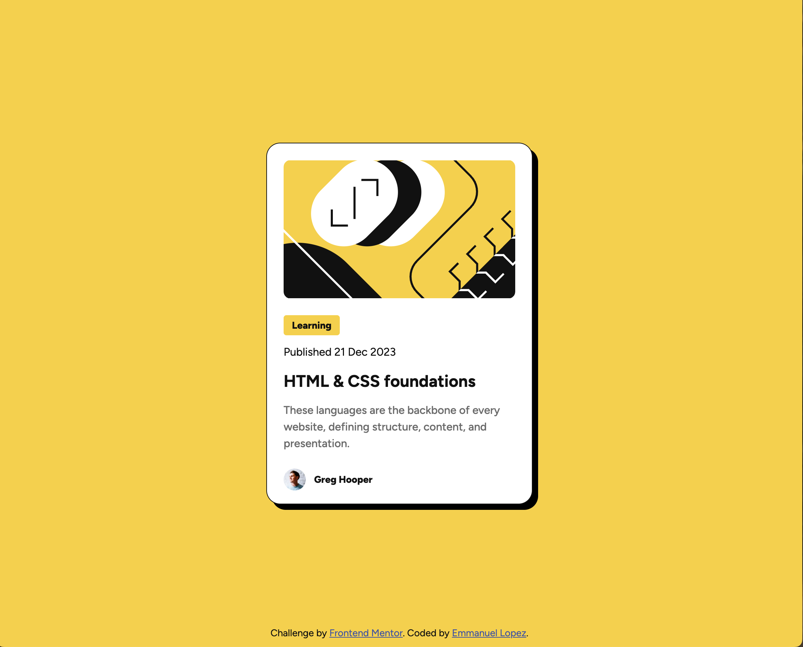

# Frontend Mentor - Blog preview card solution

This is a solution to the [Blog preview card challenge on Frontend Mentor](https://www.frontendmentor.io/challenges/blog-preview-card-ckPaj01IcS). Frontend Mentor challenges help you improve your coding skills by building realistic projects.

## Table of contents

-   [Frontend Mentor - Blog preview card solution](#frontend-mentor---blog-preview-card-solution)
    -   [Table of contents](#table-of-contents)
    -   [Overview](#overview)
        -   [The challenge](#the-challenge)
        -   [Screenshot](#screenshot)
        -   [Links](#links)
    -   [My process](#my-process)
        -   [Built with](#built-with)
        -   [What I learned](#what-i-learned)
        -   [Continued development](#continued-development)
    -   [Author](#author)

## Overview

### The challenge

Users should be able to:

-   See hover and focus states for all interactive elements on the page

### Screenshot

### Links

-   Solution URL: [https://github.com/EmLopezDev/Blog-Preview-Card](https://github.com/EmLopezDev/Blog-Preview-Card)
-   Live Site URL: [https://emlopezdev.github.io/Blog-Preview-Card)](https://emlopezdev.github.io/Blog-Preview-Card/)

## My process

### Built with

-   Semantic HTML5
-   CSS using custom variables
-   Flexbox

### What I learned

-   It's getting easier to understand Figma files and also look at the requirement on them
-   Gaining a better understanding of semantic HTML and what tags to use
-   The more you practice the easier it becomes but also the more you remember for the next project

### Continued development

-   Continue learning semantic HTML, I want to get to a point where I am choosing he right tags for the right use cases.
-   Organize my CSS file a little more I feel the one I created here was a bit all over.

## Author

-   Frontend Mentor - [@EmLopezDev](https://www.frontendmentor.io/profile/EmLopezDev)
